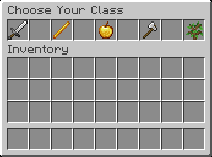
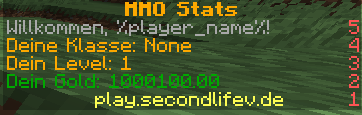

This is a ClassSystem for a MMO in Minecraft.

With /klasse you can open a GUI to choose your Class only one can picked.

You need as Dependency PlaceholderAPI(https://www.spigotmc.org/resources/placeholderapi.6245/)

To use this Placeholders:

-%classsystem_class%

-%classsystem_level%

-%classsystem_mana%

 Scoreboard not included!